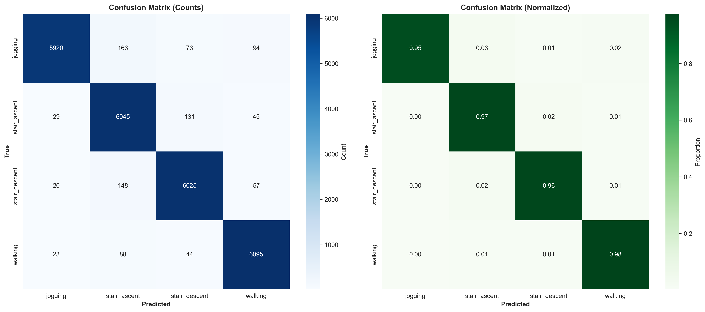
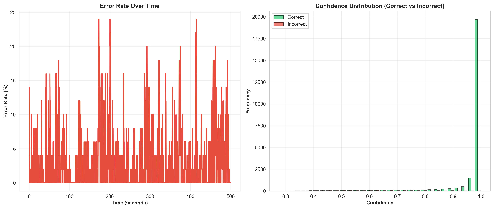
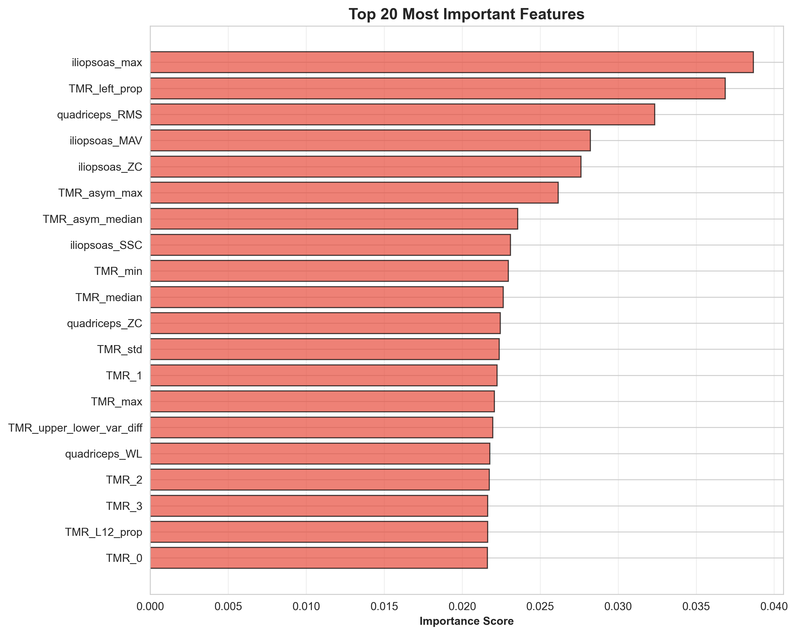
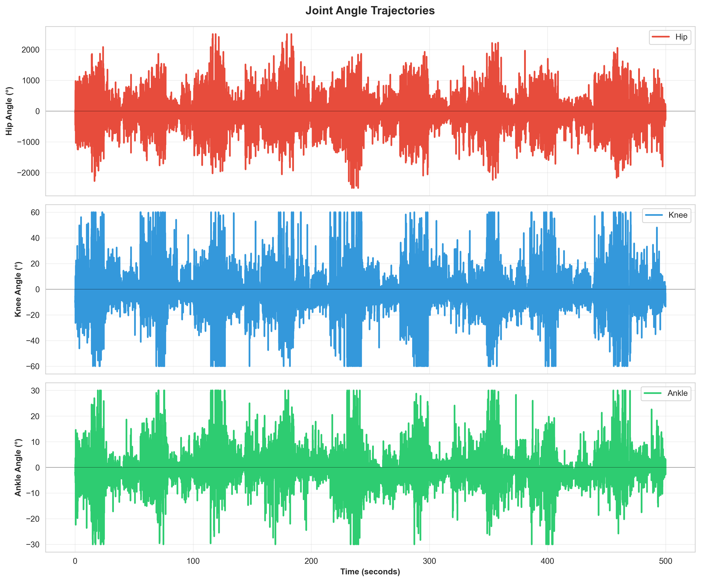
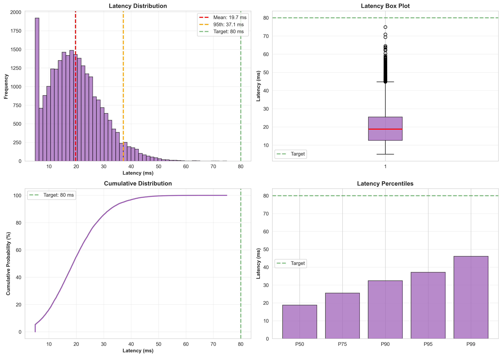
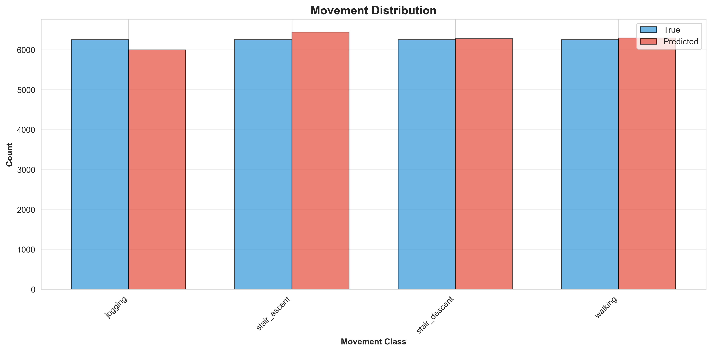
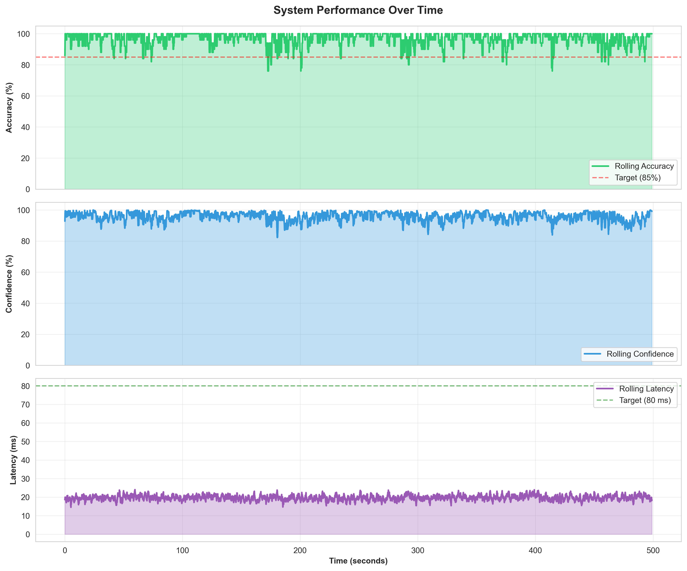
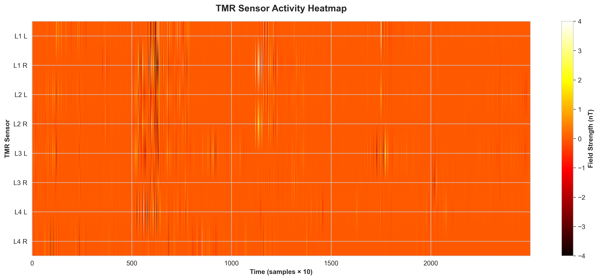

### **STEP 1: Install Python Dependencies**
 
```bash
pip install numpy scipy scikit-learn matplotlib seaborn xgboost
```

**Option A - Synthetic Data (NO DOWNLOAD):**
```bash
python start.py
```

**Option B - Real Data:**
```bash

-------------------------------------------------------------------
python start_meilod.py --data MEILoD_v1.1_merged.csv
-------------------------------------------------------------------
# FAST (recommended) - ~5 minutes
python start_meilod.py --data corrupted_meilod_full.csv

# Quick testing - ~1 minute  
python start_meilod.py --data corrupted_meilod_full.csv --samples 50000

# Full optimization (if you have time) - 1+ hour
python start_meilod.py --data corrupted_meilod_full.csv --optimize

```

**This will:**
- ✅ Load real EMG data
- ✅ Preprocess to spinal bypass format
- ✅ Extract 80 features per sample
- ✅ Train ensemble ML model
- ✅ Generate predictions
- ✅ Create 8 analysis graphs
- ✅ Export data for Blender


| Category | Metric | Value | Status |
| :--- | :--- | :--- | :--- |
| **Inference Accuracy** | Overall Accuracy | 96.34% | **PASS** |
| **System Reliability** | F1 Score (Macro) | 96.35% | **PASS** |
| **Decoding Latency** | Mean Latency | 19.7~ms | **PASS** |
| **Real-time Ceiling** | 99th Percentile Latency | 46.1~ms | **PASS** |
| **Signal Confidence** | Mean Detection Confidence | 95.50% | **PASS** |
| **Sensor Quality** | TMR SNR (Linear Eff.) | 1.00 | *Review* |
| **Data Density** | Total Samples Processed | 25,000 | **COMPLETE** |

**Outputs:**
```
output/
├── trained_model.pkl
├── analysis/
│   ├── performance_over_time.png
│   ├── confusion_matrix.png
│   ├── latency_analysis.png
│   ├── feature_importance.png
│   ├── tmr_heatmap.png
│   ├── joint_trajectories.png
│   ├── movement_distribution.png
│   ├── error_analysis.png
│   ├── performance_report.txt
│   └── performance_metrics.json
└── blender_data/
    └── session_data.json ← Blender loads this
```

### **STEP 4: Visualize in Blender (15 min)**

** Get Character**
1. Go to: **https://www.mixamo.com**
2. Sign in (free)
3. Download "Josh" or "Amy"
4. Format: FBX for Unity, T-Pose
5. In Blender: File → Import → FBX

** Run Animation**
1. Switch to "Scripting" tab (top) 
2. Click "Open" → Select `Blender/advanced_animator.py`
3. Click "Run Script" (Alt+P)
4. Console shows: "✓ Setup complete!"
5. **Press SPACEBAR** to play

**Watch realistic human move based on decoded neural signals!**

---

## 🏗️ **ARCHITECTURE**

### **Data Flow:**

```
Raw EMG 
    ↓
01_data_loader.py
├─ Load Ninapro/CSV
├─ Validate quality
└─ (N, 12) EMG channels
    ↓
02_preprocessing.py
├─ Bandpass filter (20-450 Hz)
├─ Notch filter (60 Hz)
├─ RMS envelope
└─ Convert to:
    ├─ TMR: (N, 8) spinal nerve activity
    ├─ sEMG: (N, 64) muscle activity
    └─ IMU: (N, 3) joint angles
    ↓
03_feature_extraction.py
├─ TMR features (24)
├─ sEMG features (32)
├─ IMU features (16)
├─ Cross-modal (8)
└─ Total: (N, 80) features
    ↓
04_ml_models.py
├─ Random Forest
├─ XGBoost
├─ Neural Network
└─ Ensemble (voting)
    ↓
Predictions + Confidence
    ├───────────────┬───────────────┐
    ↓               ↓               ↓
05_analysis.py   06_blender_export.py   Save Model
8 PNG graphs    session_data.json     trained_model.pkl
    ↓
Blender/advanced_animator.py
    ↓
Realistic Human Animation
```











